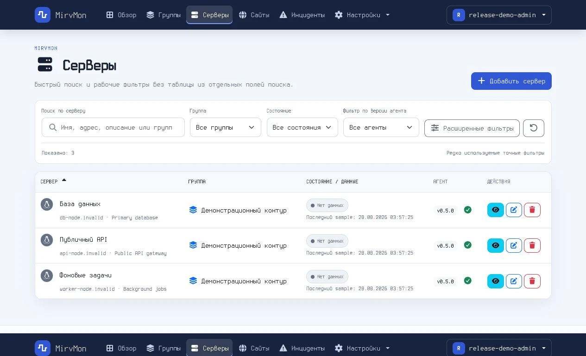
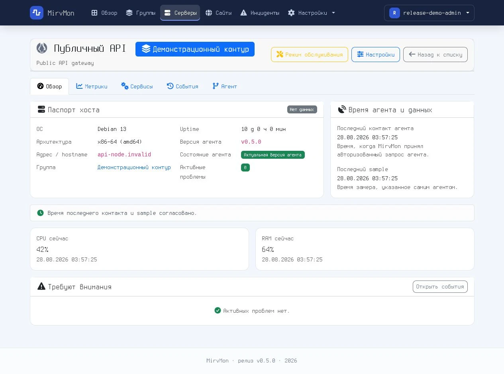
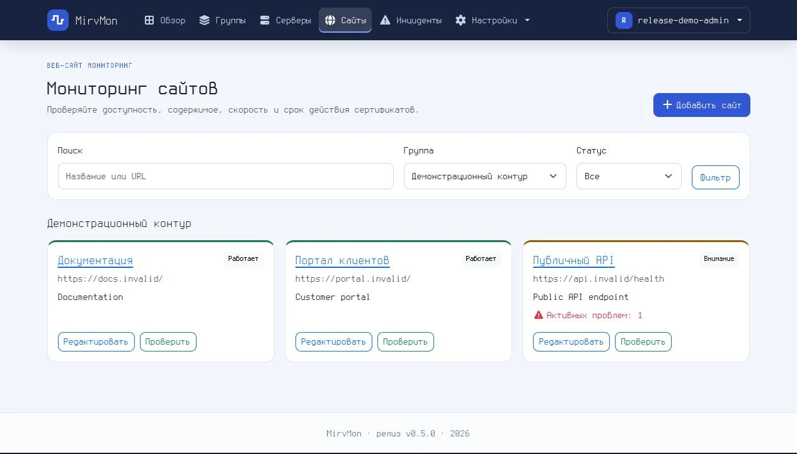
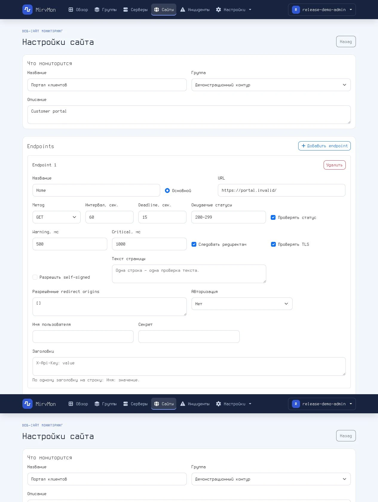

# MirvMon

[](LICENSE)

MirvMon — self-hosted система мониторинга серверов и сайтов. Агенты сами отправляют
метрики исходящими HTTPS-запросами, поэтому для наблюдаемых серверов не нужны
входящие порты и белые IP-адреса.

## Текущий стек

- PHP 8.5, Slim 4 и Twig 3;
- FrankenPHP в classic mode как основной HTTP runtime;
- PostgreSQL 17 с TimescaleDB 2.28 для метрик и агрегатов;
- нативный Go-агент для x64 Linux и Windows;
- локальные Bootstrap 5.3.8, Chart.js 4.5.1 и Font Awesome 7.3.1.

Прикладной код использует PSR-интерфейсы и не обращается к API FrankenPHP или
Caddy. При необходимости HTTP-слой можно запустить через nginx + PHP-FPM без
изменения контроллеров и бизнес-логики.

## Архитектура развёртывания

Production stack состоит ровно из двух контейнеров:

```text
агенты за NAT ── HTTPS POST ──> внешний nginx ── HTTP ──> app:8080
                                                            │
                                                            ▼
                                                    db (TimescaleDB)
```

- `app` — rootless FrankenPHP, PHP-приложение и фоновые процессы;
- `db` — внутренний PostgreSQL/TimescaleDB без опубликованного порта;
- внешний nginx завершает TLS и проксирует запросы на loopback-порт приложения;
- данные приложения и БД находятся в именованных Docker volumes.

История метрик хранится в TimescaleDB hypertable и continuous aggregates.
Dashboard читает отдельный компактный `current_metric_values`, поэтому его
время ответа не растёт вместе с 60-дневной raw-историей.

## Мониторинг сайтов

Сайты проверяет централизованный `website-check-worker` внутри `app`; отдельного
Compose-сервиса и проб на native agent нет. Администратор задаёт endpoint,
ожидаемый HTTP status, page-text assertions, deadline, TTFB/total thresholds,
redirect origins, auth/headers и TLS. Внутренние targets разрешены только как
осознанная модель trusted-admin deployment: SSRF-защита блокирует loopback,
private/link-local и metadata адреса, а redirect проверяется на каждом переходе.

Результаты хранятся в `website_state`, endpoint state и TimescaleDB samples.
Текущие страницы используют state read model, а история за 30 days и 365 days
читается через raw/hourly/daily retention path. Инциденты, maintenance и
доставка уведомлений разделены: maintenance продолжает создавать события, но
подавляет delivery; pause выключает проверки сайта. Self-signed сертификат
разрешается только явной настройкой endpoint и всё равно отображается как
отдельное предупреждение. Domain expiry targets получают данные через RDAP,
затем WHOIS fallback; отсутствие authoritative ответа не считается здоровым.

Worker отмечает heartbeat, claim-ит очередь с lease, выполняет HTTP/TLS/domain
checks вне длинной DB-транзакции и записывает безопасную диагностику без auth,
headers или response body. Проверить его состояние можно в `/admin/system` и
одноразовым `bin/website-check-worker --once`.

Основные UI routes: `/sites`, `/sites/{id}`, `/alerts`, `/groups`; dashboard
показывает отдельные сводки servers/sites и объединённый список attention.
Адаптивный интерфейс поддерживает desktop и viewport 390 px.

В `v0.5.1` доведён до рабочего эксплуатационного вида интерфейс мониторинга
сайтов: карточки показывают ключевые показатели, страница сайта стала основной
точкой входа, а вкладка метрик получила KPI и графики доступности/скорости.
Подробности изменений и upgrade notes: [v0.5.1](docs/releases/v0.5.1.md).

## Интерфейс

<p align="center">
  <a href="docs/screenshots/dashboard.webp"></a>
  <a href="docs/screenshots/servers.webp"></a>
</p>
<p align="center">
  <a href="docs/screenshots/server-overview.webp"></a>
  <a href="docs/screenshots/server-metrics.webp"></a>
</p>
<p align="center">
  <a href="docs/screenshots/websites.webp"></a>
  <a href="docs/screenshots/website-settings.webp"></a>
</p>

## Запуск через Portainer

1. Создайте Docker Standalone stack из Git-репозитория.
2. Укажите compose path `docker/docker-compose.yml`.
3. Добавьте переменные из `docker/.env.example`.
4. Обязательно задайте три независимых секрета:

```bash
openssl rand -base64 32  # APP_KEY
openssl rand -hex 32     # SETUP_TOKEN
openssl rand -hex 32     # DB_PASSWORD
```

5. Разверните stack и настройте внешний nginx.
6. Откройте `https://ваш-домен/setup`, введите `SETUP_TOKEN` и создайте первого
   администратора.

MirvMon не создаёт стандартного пользователя или пароля. После появления
первого пользователя endpoint `/setup` больше не позволяет создать учётную
запись.

Production Compose загружает готовый образ из `MIRVMON_IMAGE` и не требует
поддержки Docker build со стороны Portainer. Для production рекомендуется
зафиксировать release tag образа вместо `latest`.

Tag `vX.Y.Z` запускает `.github/workflows/ci.yml`: после успешных PHP,
frontend, agent и container checks он публикует `linux/amd64` и `linux/arm64`
image в GHCR с semver-тегами, SBOM и provenance.
Docker image tag не содержит начальную `v`: Git tag `v0.1.0` публикует
`ghcr.io/mirivlad/mirvmon:0.1.0`. Prerelease tag не перезаписывает `latest`.

Подробности: [docker/README.md](docker/README.md).

## Локальная сборка

```bash
cp .env.example .env
# Заполните APP_KEY, SETUP_TOKEN и DB_PASSWORD.

docker compose --env-file .env \
  -f docker/docker-compose.yml \
  -f docker/docker-compose.build.yml \
  up -d --build
```

Либо используйте `docker/deploy.sh`: скрипт создаст `.env` с правами `0600`,
сгенерирует секреты, проверит Compose и запустит те же два сервиса.

## Внешний nginx

Минимальный фрагмент внутри существующего HTTPS `server`:

```nginx
location / {
    proxy_pass http://127.0.0.1:8080;
    proxy_http_version 1.1;
    proxy_set_header Host $host;
    proxy_set_header X-Real-IP $remote_addr;
    proxy_set_header X-Forwarded-For $proxy_add_x_forwarded_for;
    proxy_set_header X-Forwarded-Proto $scheme;
    proxy_read_timeout 60s;
    client_max_body_size 2m;
}
```

По умолчанию приложение слушает только `127.0.0.1:8080`. Если nginx находится
на другом узле, задайте подходящий `APP_BIND_ADDRESS` и ограничьте доступ к
порту firewall.

`PUBLIC_BASE_URL=https://monitoring.example.com` задаёт канонический публичный
URL. Если переменная пуста, приложение использует scheme и host текущего
запроса только после проверки доверенного reverse proxy.

`SESSION_SECURE=1` включён в production по умолчанию: браузер передаёт
session cookie только через HTTPS. Значение `0` допустимо лишь для изолированной
локальной разработки с прямым HTTP-доступом.

## Проверка состояния и логи

```bash
curl --fail http://127.0.0.1:8080/livez   # HTTP runtime
curl --fail http://127.0.0.1:8080/readyz  # приложение + БД

docker compose -f docker/docker-compose.yml logs -f app
docker compose -f docker/docker-compose.yml logs -f db
```

Контейнерный healthcheck использует `/readyz`. Миграции запускаются при старте
приложения под advisory lock; изменённый checksum уже применённой миграции
считается ошибкой.

## Агент

Добавьте сервер в веб-интерфейсе и скачайте персонализированный установщик:
Linux shell либо единый Windows x64 EXE. Installer credential действует один
час и не является permanent agent token. Постоянный token не передаётся в URL,
а на стороне MirvMon хранится только его SHA-256.

Агент работает по push-модели: получает remote config и отправляет метрики
исходящими HTTPS-запросами, поэтому наблюдаемому серверу не нужен входящий порт
или белый IP. Недоставленные замеры сохраняются в bounded disk queue и
досылаются после восстановления связи.

Официальные сборки — x64. Поддерживаются Linux systemd (Debian 11+, Ubuntu
20.04+, RHEL/CentOS/Oracle Linux 7+, Alma/Rocky Linux 8+, NethServer 7),
современные Windows 10/11 и Server 2016–2025, а также legacy Windows 7 SP1,
8/8.1 и Server 2008 R2 SP1/2012/2012 R2. Windows Server 2008 без R2 и 32-bit
системы не поддерживаются.

На Linux основные файлы находятся здесь:

```text
/opt/mirvmon-agent/mirvmon-agent
/etc/mirvmon-agent/config.json
/var/lib/mirvmon-agent/queue.json
/var/lib/mirvmon-agent/health.json
```

Быстрая диагностика:

```bash
sudo systemctl status mirvmon-agent --no-pager -l
sudo /opt/mirvmon-agent/mirvmon-agent version
sudo -u mirvmon-agent /opt/mirvmon-agent/mirvmon-agent check \
  --config /etc/mirvmon-agent/config.json --server
sudo -u mirvmon-agent /opt/mirvmon-agent/mirvmon-agent once \
  --config /etc/mirvmon-agent/config.json --require-delivery
```

Новые версии агента различают `authentication_error`, `dns_error`,
`network_timeout`, `network_error`, `tls_error`, `server_error`,
`configuration_error` и `runtime_error`; подробность сохраняется в
`health.json` и выводится диагностическими командами.

Полная эксплуатационная справка: **[docs/agent.md](docs/agent.md)**. Пошаговая
диагностика DNS/TCP/TLS/auth/server response: **[docs/troubleshooting.md](docs/troubleshooting.md)**.

Capable agent начиная с `v0.4.3` поддерживает отдельную self-update команду из
UI. Агент получает только типизированное описание проверенного artifact, а не
произвольную shell-команду, URL или путь. Детали установки, rollback и
обновления вынесены в документацию агента.

### Протокол отправки

`POST /api/v1/metrics` принимает JSON envelope v2. Новый `sample_id` получает
`202`, уже принятый — `200`. Remote config агент периодически получает через
`GET /api/v1/agent/config` с Bearer token. Полный контракт описан в
[TECHNICAL_SPECIFICATION.md](TECHNICAL_SPECIFICATION.md).

## Уведомления

SMTP и Telegram настраиваются в `/admin/notifications`. Доставка не выполняется
в HTTP-запросе и не замедляет приём метрик: событие атомарно записывается в
`notification_outbox`, а `notification-worker` отправляет его в фоне. Повторные
попытки имеют exponential backoff; после десяти ошибок запись переходит в
состояние `dead`.

Для Telegram можно выбрать прямое соединение либо HTTP, HTTPS, SOCKS4, SOCKS4A,
SOCKS5 или SOCKS5H proxy. Хост, порт, логин и пароль задаются отдельными полями;
прокси применяется только к Telegram. Прокси, который слушает на самом хосте
Docker, указывается как `host.docker.internal` — production Compose объявляет
это имя через `host-gateway`. Адрес `127.0.0.1` в этом поле указывает на сам
контейнер и работать не будет. Bot token, SMTP password и proxy password
шифруются authenticated encryption с `APP_KEY`. Веб-интерфейс показывает только
факт наличия секрета: пустое поле сохраняет прежнее значение, а удаление требует
отдельного checkbox.

Получатели задаются на двух уровнях. В общих настройках указывается Telegram
chat ID и список адресов email через запятую (до двадцати). У каждого сервера
на странице редактирования есть необязательное переопределение: заполненные
поля полностью заменяют общие значения, поэтому конкретный сервер можно
закрепить за конкретным человеком. Пустые поля означают «как у всех».

Каждый получатель получает собственное задание очереди — отказ одного адреса не
задерживает остальные, и в таблице очереди видно, кому именно ушло сообщение.
Получатель фиксируется в момент постановки в очередь, поэтому смена общего
адреса не перенаправляет уже поставленные уведомления.

Кнопка «Сохранить и отправить тест» сохраняет настройки и ставит отдельное
сообщение для каждого получателя каждого включённого канала в ту же очередь. Синхронных внешних
запросов из dashboard нет.

У порога две независимые выдержки. `duration_seconds` требует, чтобы метрика
держалась выше порога заданное время до создания алерта;
`recovery_duration_seconds` — чтобы она держалась ниже порога всё это время до
снятия алерта. По умолчанию восстановление ждёт 300 секунд, поэтому метрика,
колеблющаяся вокруг порога, не превращается в поток «алерт — восстановление —
алерт». Оба значения задаются на сервер и метрику на вкладке порогов, а
значения по умолчанию — в `/admin/defaults`. Ноль в любом из полей означает
немедленную реакцию.

К уведомлению о метрике прикладывается график этой метрики за последний час:
в Telegram сообщение уходит как `sendPhoto` с текстом в подписи, в письме —
вложением `metric.png`. На графике пунктиром отмечен сработавший порог.
Картинка рисуется через GD прямо в worker, без браузера и внешних сервисов;
если данных меньше двух точек или отрисовка не удалась, уведомление уходит
обычным текстом. События сервисов и offline графика не имеют.

Необязательная пауза между одинаковыми уведомлениями (`cooldown_seconds`,
по умолчанию ноль — ограничения нет) не даёт метрике, зависшей на пороге,
слать одно и то же сообщение подряд: в течение паузы повторное событие того же
типа по той же метрике того же сервера в очередь не попадает. Восстановление —
событие другого типа, поэтому отбой приходит без задержки. Обычно этого не
требуется: выдержка восстановления уже гасит основной источник дребезга.

На странице сервера включается окно обслуживания на 30 минут — 24 часа с
необязательной причиной. Пока оно открыто, алерты по этому серверу продолжают
создаваться и видны в интерфейсе, но в очередь доставки не попадают — плановый
перезапуск никого не будит. Окно закрывается кнопкой досрочно или само по
истечении срока; на другие серверы оно не влияет.

Алерт, снятый вручную на странице `/alerts`, уходит в те же каналы отдельным
событием `alert_resolved` с именем снявшего пользователя — молчаливого
закрытия не происходит. В каждое уведомление о конкретном сервере добавляется
прямая ссылка на его страницу с метриками. Ссылка появляется только при
заданном `PUBLIC_BASE_URL`: notification-worker работает вне HTTP-запроса и
собственный адрес установки узнать не может.

Та же страница показывает состояние фоновых worker: каждый из них отмечается в
`worker_heartbeats` на каждой итерации цикла, и молчание дольше двух минут
выводится красным бейджем. Это отвечает на вопрос «очередь не разбирается
потому, что доставка ломается, или потому, что worker умер».

Доставленные и мёртвые задания очереди не копятся вечно: notification-worker
раз в час удаляет `sent` старше `NOTIFICATION_SENT_RETENTION_DAYS` (7 суток по
умолчанию) и `dead` старше `NOTIFICATION_DEAD_RETENTION_DAYS` (30 суток).
Задания в состояниях `pending`, `processing` и `failed` не удаляются никогда.

Та же страница показывает последние двадцать заданий очереди: канал, статус,
число попыток и причину отказа, которую вернул Telegram или SMTP-сервер
(например `telegram_http_400: chat not found`). Кнопка «Повторить неудачные»
возвращает записи `failed` и `dead` в состояние `pending` с новым бюджетом
попыток — это штатный способ дослать уведомления после исправления токена или
сетевого доступа. Задание для выключенного канала помечается `dead` с причиной
`channel_disabled` и никогда не выдаётся за отправленное.

## Разработка и проверки

```bash
composer install
composer test
composer analyse
composer audit
npm ci
npm run assets:sync
npm audit
(cd agent && go test ./...)
(cd agent && go test -race ./...)
```

Для schema integration tests требуется отдельная TimescaleDB. Переменные
`TEST_DB_HOST`, `TEST_DB_PORT`, `TEST_DB_NAME`, `TEST_DB_USERNAME`,
`TEST_DB_PASSWORD` и `TEST_DB_SSLMODE` должны указывать на изолированную
тестовую БД. Без них PHPUnit явно помечает DB-набор как skipped, поэтому release
проверяется только с заданными переменными.

Скомпилированные browser assets хранятся в `public/vendor`, поэтому production
не зависит от npm или внешнего CDN. `package-lock.json` фиксирует build-time
источник; после изменения frontend-зависимостей выполните `npm ci` и
`npm run assets:sync`.

CI в `.github/workflows/ci.yml` проверяет PHP 8.5 на TimescaleDB, PHPStan
level 6, воспроизводимость frontend assets, Go 1.26.5 и Go 1.20.14, реальную
NSIS-сборку Windows EXE, а также production Docker image. Release workflow
публикует multi-arch image в GHCR, а Dependabot следит за Composer, npm, Docker
и GitHub Actions.

## Документация

- [Навигатор по документации](docs/README.md)
- [Установка](INSTALL.md)
- [Агент](docs/agent.md)
- [Troubleshooting](docs/troubleshooting.md)
- [FAQ](docs/faq.md)
- [Use cases](docs/use-cases.md)
- [Архитектура](ARCHITECTURE.md)
- [Техническая спецификация](TECHNICAL_SPECIFICATION.md)
- [Docker и Portainer](docker/README.md)
- [Roadmap](ROADMAP.md) и [Changelog](CHANGELOG.md)
