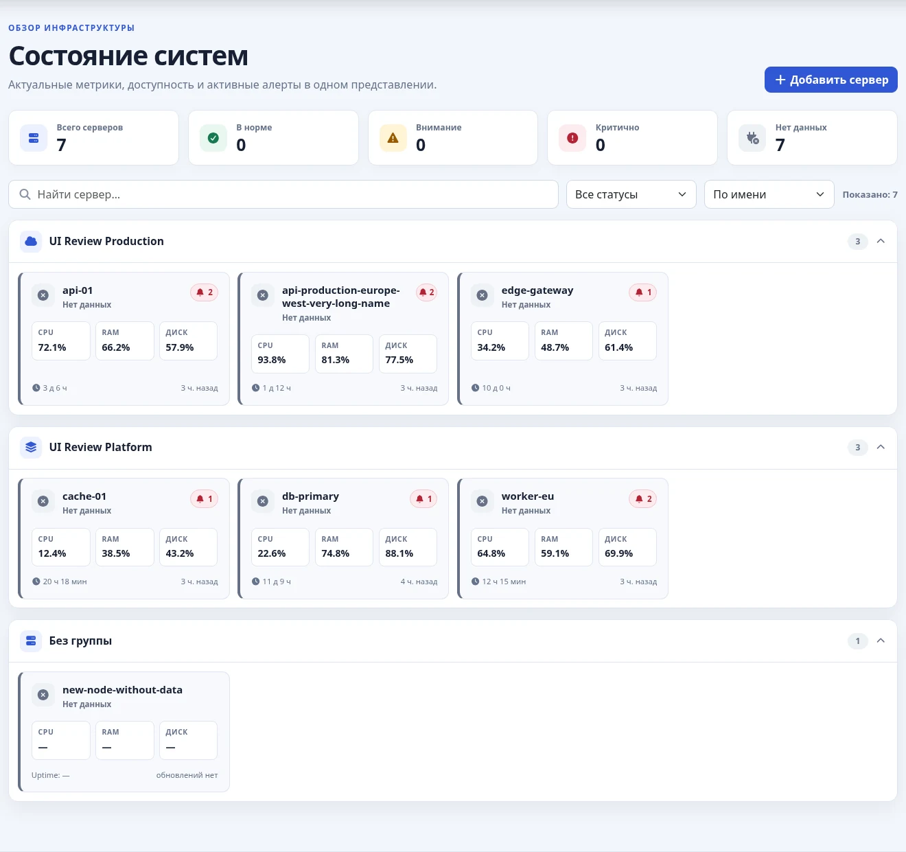
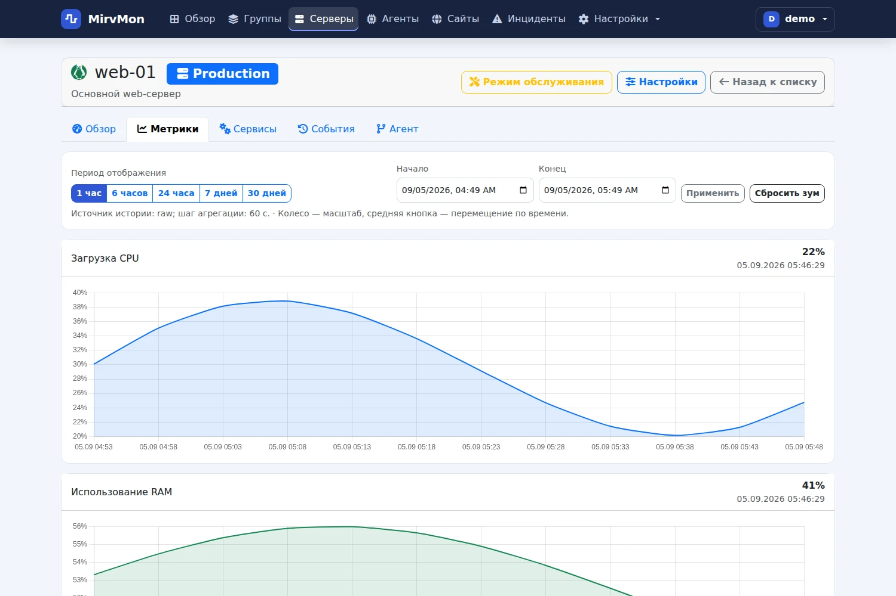
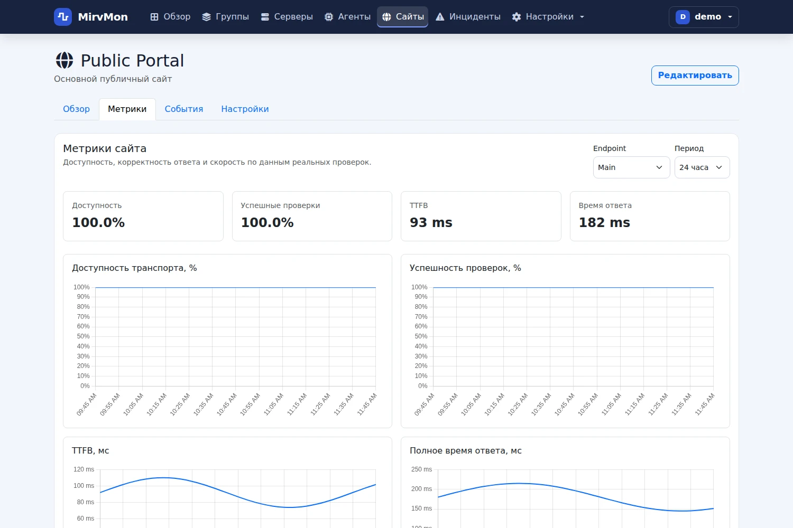

# MirvMon

[](LICENSE)

MirvMon — self-hosted система мониторинга серверов и сайтов для домашней и небольшой рабочей инфраструктуры.
Серверные агенты отправляют метрики исходящими HTTPS-запросами, поэтому наблюдаемым машинам не нужны входящие порты и белые IP-адреса.

## Возможности

- серверы: CPU, RAM, диски, I/O, сеть, температуры, uptime, процессы и systemd/Windows services;
- сайты: HTTP(S), несколько endpoint, status ranges, redirects, TLS, проверка текста, auth/headers и сроки регистрации домена;
- история и графики на TimescaleDB, периоды от часа до года;
- алерты, recovery, maintenance windows и единая лента инцидентов;
- Telegram и SMTP с очередью, retry/backoff и индивидуальными получателями;
- графики в уведомлениях для метрик серверов и измеряемых проверок сайтов;
- нативный Go-агент для x64 Linux и Windows;
- Docker/Portainer, готовые multi-arch образы `amd64` и `arm64` в GHCR.

## Интерфейс

Скриншоты ниже сняты на синтетических демонстрационных данных.

### Главная



### Метрики сервера



### Метрики сайта



## Быстрый старт

Production stack состоит из `app` и `db`; TLS обычно завершает внешний nginx.

1. Создайте Docker/Portainer stack из этого репозитория с compose-файлом `docker/docker-compose.yml`.
2. Скопируйте переменные из `docker/.env.example` и обязательно задайте `APP_KEY`, `SETUP_TOKEN` и `DB_PASSWORD`.
3. Укажите образ релиза, например `ghcr.io/mirivlad/mirvmon:0.6.8`.
4. Настройте reverse proxy на приложение.
5. Откройте `https://ваш-домен/setup`, введите `SETUP_TOKEN` и создайте первого администратора.

Подробно: [INSTALL.md](INSTALL.md) и [docker/README.md](docker/README.md).

## Агент

Добавьте сервер в веб-интерфейсе и скачайте персонализированный установщик для Linux или Windows.
Агент получает конфигурацию и отправляет метрики на MirvMon исходящими HTTPS-запросами; при временной недоступности сервера мониторинга замеры сохраняются в bounded disk queue и досылаются позже.

Официальные сборки — x64. Поддерживаются современные Linux systemd и Windows, а также legacy Windows 7 SP1 / Server 2008 R2 SP1 и новее в пределах возможностей ОС.

## Мониторинг сайтов

Проверки выполняет центральный `website-check-worker`, отдельный агент на веб-сервере не нужен.
Для сайта можно задать несколько endpoint, основной URL, допустимые HTTP-статусы, redirects, TLS, содержимое страницы, пороги времени ответа и дополнительные проверки домена.

Страница сайта содержит обзор, метрики, события и настройки. История включает доступность, успешность assertions, TTFB и полное время ответа.

## Уведомления

Telegram и SMTP настраиваются в интерфейсе администратора. Доставка выполняется фоновым worker через outbox, поэтому внешние сервисы не задерживают приём метрик и работу UI.

Для срабатываний по числовым метрикам сервера к сообщению прикладывается график за последний час с отмеченным порогом; offline-события получают график доступности. Для HTTP/assertion/performance-событий сайтов прикладывается соответствующий график доступности, успешности проверки или времени ответа, если накоплено достаточно данных. Сервисные события без временного ряда остаются текстовыми.

## Технологии

PHP 8.5, Slim 4, Twig 3, FrankenPHP, PostgreSQL 17 + TimescaleDB, Bootstrap 5, Chart.js и Go.
Production-образ не зависит от внешних CDN.

## Документация

- [INSTALL.md](INSTALL.md) — установка и первый запуск;
- [docker/README.md](docker/README.md) — Docker, Portainer и обновление;
- [ARCHITECTURE.md](ARCHITECTURE.md) — архитектура;
- [TECHNICAL_SPECIFICATION.md](TECHNICAL_SPECIFICATION.md) — техническая спецификация;
- [docs/releases](docs/releases) — заметки к релизам.

## Разработка

```bash
composer install
composer test
composer analyse
npm ci
npm run assets:sync
```

CI дополнительно проверяет интеграцию с TimescaleDB, frontend assets, агент и production Docker image.

## Лицензия

MIT
