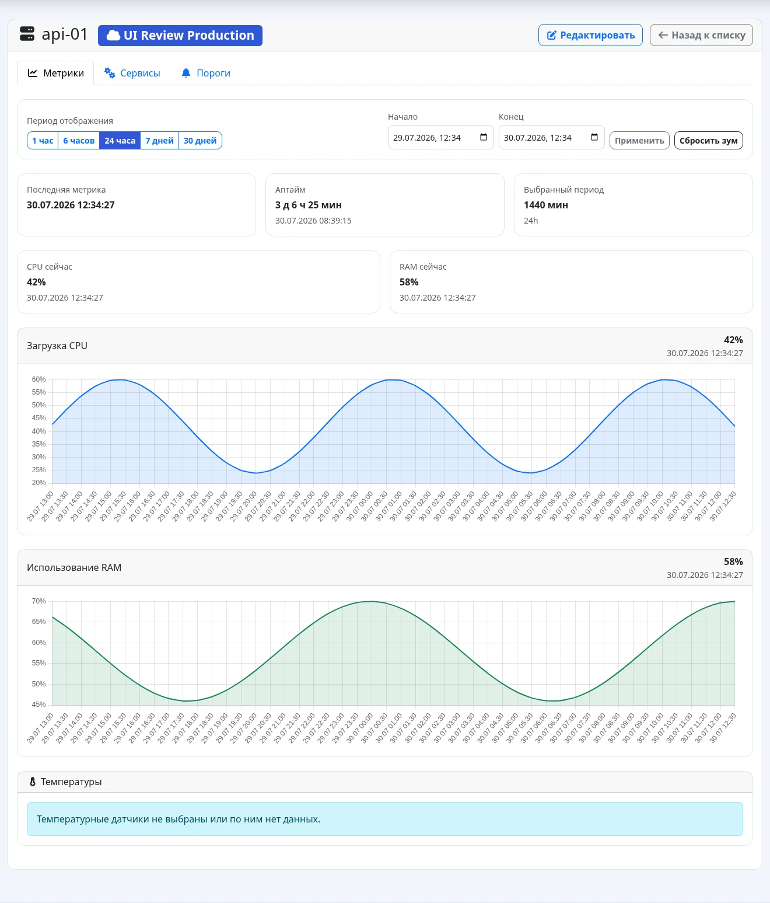
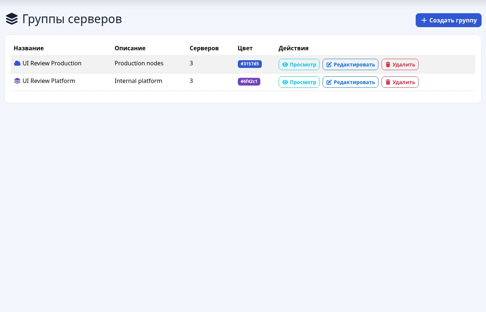
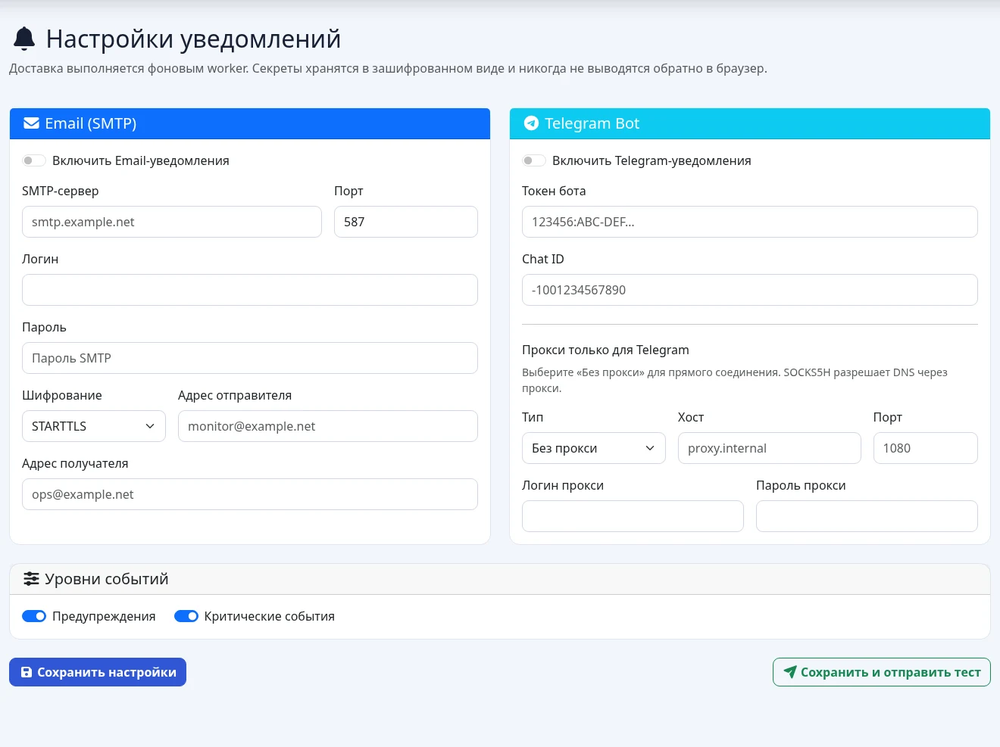

# MirvMon

[](LICENSE)

MirvMon — self-hosted система мониторинга серверов. Агенты сами отправляют
метрики исходящими HTTPS-запросами, поэтому для наблюдаемых серверов не нужны
входящие порты и белые IP-адреса.

## Текущий стек

- PHP 8.5, Slim 4 и Twig 3;
- FrankenPHP в classic mode как основной HTTP runtime;
- PostgreSQL 17 с TimescaleDB 2.28 для метрик и агрегатов;
- нативный Go-агент для x64 Linux и Windows;
- локальные Bootstrap 5.3.8, Chart.js 4.5.1 и Font Awesome 7.3.1.

Прикладной код использует PSR-интерфейсы и не обращается к API FrankenPHP или
Caddy. При необходимости HTTP-слой можно запустить через nginx + PHP-FPM без
изменения контроллеров и бизнес-логики.

## Архитектура развёртывания

Production stack состоит ровно из двух контейнеров:

```text
агенты за NAT ── HTTPS POST ──> внешний nginx ── HTTP ──> app:8080
                                                            │
                                                            ▼
                                                    db (TimescaleDB)
```

- `app` — rootless FrankenPHP, PHP-приложение и фоновые процессы;
- `db` — внутренний PostgreSQL/TimescaleDB без опубликованного порта;
- внешний nginx завершает TLS и проксирует запросы на loopback-порт приложения;
- данные приложения и БД находятся в именованных Docker volumes.

История метрик хранится в TimescaleDB hypertable и continuous aggregates.
Dashboard читает отдельный компактный `current_metric_values`, поэтому его
время ответа не растёт вместе с 60-дневной raw-историей.

## Интерфейс

<p align="center">
  <a href="docs/screenshots/dashboard.webp"></a>
  <a href="docs/screenshots/server-detail.webp"></a>
</p>
<p align="center">
  <a href="docs/screenshots/groups.webp"></a>
  <a href="docs/screenshots/notification-settings.webp"></a>
</p>

## Запуск через Portainer

1. Создайте Docker Standalone stack из Git-репозитория.
2. Укажите compose path `docker/docker-compose.yml`.
3. Добавьте переменные из `docker/.env.example`.
4. Обязательно задайте три независимых секрета:

```bash
openssl rand -base64 32  # APP_KEY
openssl rand -hex 32     # SETUP_TOKEN
openssl rand -hex 32     # DB_PASSWORD
```

5. Разверните stack и настройте внешний nginx.
6. Откройте `https://ваш-домен/setup`, введите `SETUP_TOKEN` и создайте первого
   администратора.

MirvMon не создаёт стандартного пользователя или пароля. После появления
первого пользователя endpoint `/setup` больше не позволяет создать учётную
запись.

Production Compose загружает готовый образ из `MIRVMON_IMAGE` и не требует
поддержки Docker build со стороны Portainer. Для production рекомендуется
зафиксировать release tag образа вместо `latest`.

Tag `vX.Y.Z` запускает `.github/workflows/ci.yml`: после успешных PHP,
frontend, agent и container checks он публикует `linux/amd64` и `linux/arm64`
image в GHCR с semver-тегами, SBOM и provenance.
Docker image tag не содержит начальную `v`: Git tag `v0.1.0` публикует
`ghcr.io/mirivlad/mirvmon:0.1.0`. Prerelease tag не перезаписывает `latest`.

Подробности: [docker/README.md](docker/README.md).

## Локальная сборка

```bash
cp .env.example .env
# Заполните APP_KEY, SETUP_TOKEN и DB_PASSWORD.

docker compose --env-file .env \
  -f docker/docker-compose.yml \
  -f docker/docker-compose.build.yml \
  up -d --build
```

Либо используйте `docker/deploy.sh`: скрипт создаст `.env` с правами `0600`,
сгенерирует секреты, проверит Compose и запустит те же два сервиса.

## Внешний nginx

Минимальный фрагмент внутри существующего HTTPS `server`:

```nginx
location / {
    proxy_pass http://127.0.0.1:8080;
    proxy_http_version 1.1;
    proxy_set_header Host $host;
    proxy_set_header X-Real-IP $remote_addr;
    proxy_set_header X-Forwarded-For $proxy_add_x_forwarded_for;
    proxy_set_header X-Forwarded-Proto $scheme;
    proxy_read_timeout 60s;
    client_max_body_size 2m;
}
```

По умолчанию приложение слушает только `127.0.0.1:8080`. Если nginx находится
на другом узле, задайте подходящий `APP_BIND_ADDRESS` и ограничьте доступ к
порту firewall.

`PUBLIC_BASE_URL=https://monitoring.example.com` задаёт канонический публичный
URL. Если переменная пуста, приложение использует scheme и host текущего
запроса только после проверки доверенного reverse proxy.

`SESSION_SECURE=1` включён в production по умолчанию: браузер передаёт
session cookie только через HTTPS. Значение `0` допустимо лишь для изолированной
локальной разработки с прямым HTTP-доступом.

## Проверка состояния и логи

```bash
curl --fail http://127.0.0.1:8080/livez   # HTTP runtime
curl --fail http://127.0.0.1:8080/readyz  # приложение + БД

docker compose -f docker/docker-compose.yml logs -f app
docker compose -f docker/docker-compose.yml logs -f db
```

Контейнерный healthcheck использует `/readyz`. Миграции запускаются при старте
приложения под advisory lock; изменённый checksum уже применённой миграции
считается ошибкой.

## Установка агента

Добавьте сервер в веб-интерфейсе и скачайте один из одноразовых установщиков:
Linux shell, PowerShell, BAT или отдельный ZIP-пакет для Windows 7 и
Server 2008 R2. Ссылка действует один час и передаёт installer credential, а
не постоянный ключ агента. Обычные загрузки используют действующий ключ; его
отзыв выполняется только явным действием администратора. Постоянный ключ не
передаётся в URL и в БД хранится только как SHA-256.

Если задан `PUBLIC_BASE_URL`, установщик привязывается к нему. Иначе используется
scheme, host и port запроса, уже нормализованные middleware доверенного reverse
proxy. В исходниках нет предустановленного домена.

Все агентские сборки — только x64. Linux-сборка Go 1.26.5 поддерживает Debian
11+, Ubuntu 20.04+, RHEL/CentOS 7+, Oracle Linux 7+, AlmaLinux/Rocky Linux 8+,
NethServer 7 и их современные преемники с systemd. Windows 10/11 и Windows
Server 2016/2019/2022/2025 используют сборку Go 1.26.5. Для Windows 7 SP1,
8, 8.1 и Windows Server 2008 R2 SP1, 2012, 2012 R2 используется сборка Go
1.20.14. Windows Server 2008 без R2 и любые 32-битные системы не
поддерживаются.

Установщик скачивает один проверяемый нативный бинарник, создаёт пользователя
`mirvmon-agent` на Linux, записывает конфигурацию `/etc/mirvmon-agent/config.json`
и очередь `/var/lib/mirvmon-agent/queue.json`. При обновлении сначала
мигрируются старые Python/PowerShell config и queue в отдельные файлы; прежние
файлы заменяются только после успешной миграции и сохраняются как backup.
После переключения Linux-установщик удаляет только известные runtime-файлы
старого Python-агента из `/opt/mirvmon-agent`.

На systemd (включая systemd 219 CentOS/RHEL 7) используйте:

```bash
sudo systemctl status mirvmon-agent
sudo journalctl -u mirvmon-agent -f
```

Для outbound proxy задайте `HTTPS_PROXY`, `HTTP_PROXY` и при необходимости
`NO_PROXY` в systemd unit override. TLS certificate verification включена по
умолчанию; агент использует системный CA store.

### Windows x64

Во вкладке «Агент» скачайте единый персонализированный
`MirvMon-Agent-Setup.exe` и запустите его от имени Administrator. Установщик
содержит обе Windows-сборки и сам выбирает совместимую по данным WMI. EXE не
подписан: Windows может показать SmartScreen/Unknown publisher, поэтому запуск
нужно подтвердить вручную.

Permanent agent token в EXE не встраивается. Внутри находится одноразовый
installer credential со сроком действия один час. После проверки ОС выбранный
нативный агент обменивает его по HTTPS на конфигурацию; только успешный обмен
погашает credential. Поэтому скачанный EXE нужно запустить до истечения часа.
PowerShell 2.0 выполняет только локальную транзакцию установки и сам в сеть не
обращается.

До остановки прежнего агента installer проверяет размер, SHA-256, version и
artifact identity нового EXE, выполняет `check`, мигрирует config/queue в
staging и повторно проверяет итоговый config. Затем он сохраняет backups с
суффиксом `.legacy-<timestamp>`, блокирует повторный запуск старой scheduled
task и ещё раз мигрирует остановленную очередь. После этого он переключает
службу и подтверждает состояние
`Running`. Ошибка после переключения запускает rollback; ошибка проверки или
миграции вообще не изменяет работающий старый агент. ACL назначаются по
well-known SID и не зависят от языка Windows.

Legacy-сборка собирает те же метрики, службы, процессы, версию ОС и получает
удалённую конфигурацию, что и современная Windows-сборка.

Сервис постоянно работает под LocalSystem; недоставленные замеры хранятся в
`%ProgramData%\MirvMon\Agent\queue.json` (до 1000) и досылаются следующим
циклом. PowerShell нужен только для установки, а не для сбора метрик.

Для outbound proxy задайте `HTTPS_PROXY`, `HTTP_PROXY` и при необходимости
`NO_PROXY` в `/etc/default/mirvmon-agent`. TLS-сертификаты проверяются по
умолчанию. При недоступности сервиса bounded disk queue переживает перезапуск,
а повтор одного `sample_id` обрабатывается сервером идемпотентно.

Агент сообщает свою версию в каждом замере, она видна в колонке «Агент» в
списке серверов. Пустое значение означает агента старее 0.2.5: поле
необязательное, и замер без него принимается как раньше, а последняя известная
версия не затирается.

### Удалённое обновление агента

`v0.4.3` — первая версия с поддержкой самостоятельного обновления. Более старый
агент, включая `v0.4.2`, нужно один раз обновить обычным установщиком. После
этого вкладка «Агент» сравнивает установленную версию с версией артефакта в
контейнере мониторинга. Если совместимая версия новее, администратор может
выдать команду «Обновить агент»; массового автоматического обновления нет.

Команда приходит через существующий исходящий `GET /api/v1/agent/config` и не
содержит shell-команду, URL или путь. Агент сам выбирает фиксированный артефакт
`linux-amd64`, `windows-amd64` либо `windows-legacy-amd64`, скачивает его с того
же origin, проверяет размер, SHA-256, версию и платформу. Конфигурация, token и
очередь метрик не заменяются.

На Linux непривилегированный агент только подготавливает файл; root-owned
`mirvmon-agent-update.path` запускает ограниченный one-shot updater. На Windows
защищённая копия текущего LocalSystem-бинарника выполняет замену после остановки
service. На обеих платформах прежний бинарник сохраняется как `.previous`, а
при ошибке запуска или отсутствии `health.json` новой версии выполняется откат.

Диагностика Linux:

```bash
sudo systemctl status mirvmon-agent-update.path mirvmon-agent-update.service
sudo journalctl -u mirvmon-agent-update.service -n 100 --no-pager
```

### Протокол отправки

`POST /api/v1/metrics` принимает JSON v2:

```json
{
  "version": 2,
  "sample_id": "018f47a2-8e4c-7d0a-8d8b-45de8fd746a1",
  "sample_time": "2026-07-30T12:00:00Z",
  "token": "<agent-token>",
  "agent_version": "v0.4.3",
  "agent_artifact": "linux-amd64",
  "agent_capabilities": ["self_update_v1"],
  "os_version": "Debian GNU/Linux 12",
  "metrics": {"cpu_load": 12.5, "ram_used": 48.1},
  "services": [],
  "process_snapshot": {"top_cpu": [], "top_memory": []}
}
```

Новый sample получает `202`, уже принятый — `200`. Конфигурацию агент
периодически получает исходящим запросом `GET /api/v1/agent/config` с Bearer
token.

## Уведомления

SMTP и Telegram настраиваются в `/admin/notifications`. Доставка не выполняется
в HTTP-запросе и не замедляет приём метрик: событие атомарно записывается в
`notification_outbox`, а `notification-worker` отправляет его в фоне. Повторные
попытки имеют exponential backoff; после десяти ошибок запись переходит в
состояние `dead`.

Для Telegram можно выбрать прямое соединение либо HTTP, HTTPS, SOCKS4, SOCKS4A,
SOCKS5 или SOCKS5H proxy. Хост, порт, логин и пароль задаются отдельными полями;
прокси применяется только к Telegram. Прокси, который слушает на самом хосте
Docker, указывается как `host.docker.internal` — production Compose объявляет
это имя через `host-gateway`. Адрес `127.0.0.1` в этом поле указывает на сам
контейнер и работать не будет. Bot token, SMTP password и proxy password
шифруются authenticated encryption с `APP_KEY`. Веб-интерфейс показывает только
факт наличия секрета: пустое поле сохраняет прежнее значение, а удаление требует
отдельного checkbox.

Получатели задаются на двух уровнях. В общих настройках указывается Telegram
chat ID и список адресов email через запятую (до двадцати). У каждого сервера
на странице редактирования есть необязательное переопределение: заполненные
поля полностью заменяют общие значения, поэтому конкретный сервер можно
закрепить за конкретным человеком. Пустые поля означают «как у всех».

Каждый получатель получает собственное задание очереди — отказ одного адреса не
задерживает остальные, и в таблице очереди видно, кому именно ушло сообщение.
Получатель фиксируется в момент постановки в очередь, поэтому смена общего
адреса не перенаправляет уже поставленные уведомления.

Кнопка «Сохранить и отправить тест» сохраняет настройки и ставит отдельное
сообщение для каждого получателя каждого включённого канала в ту же очередь. Синхронных внешних
запросов из dashboard нет.

У порога две независимые выдержки. `duration_seconds` требует, чтобы метрика
держалась выше порога заданное время до создания алерта;
`recovery_duration_seconds` — чтобы она держалась ниже порога всё это время до
снятия алерта. По умолчанию восстановление ждёт 300 секунд, поэтому метрика,
колеблющаяся вокруг порога, не превращается в поток «алерт — восстановление —
алерт». Оба значения задаются на сервер и метрику на вкладке порогов, а
значения по умолчанию — в `/admin/defaults`. Ноль в любом из полей означает
немедленную реакцию.

К уведомлению о метрике прикладывается график этой метрики за последний час:
в Telegram сообщение уходит как `sendPhoto` с текстом в подписи, в письме —
вложением `metric.png`. На графике пунктиром отмечен сработавший порог.
Картинка рисуется через GD прямо в worker, без браузера и внешних сервисов;
если данных меньше двух точек или отрисовка не удалась, уведомление уходит
обычным текстом. События сервисов и offline графика не имеют.

Необязательная пауза между одинаковыми уведомлениями (`cooldown_seconds`,
по умолчанию ноль — ограничения нет) не даёт метрике, зависшей на пороге,
слать одно и то же сообщение подряд: в течение паузы повторное событие того же
типа по той же метрике того же сервера в очередь не попадает. Восстановление —
событие другого типа, поэтому отбой приходит без задержки. Обычно этого не
требуется: выдержка восстановления уже гасит основной источник дребезга.

На странице сервера включается окно обслуживания на 30 минут — 24 часа с
необязательной причиной. Пока оно открыто, алерты по этому серверу продолжают
создаваться и видны в интерфейсе, но в очередь доставки не попадают — плановый
перезапуск никого не будит. Окно закрывается кнопкой досрочно или само по
истечении срока; на другие серверы оно не влияет.

Алерт, снятый вручную на странице `/alerts`, уходит в те же каналы отдельным
событием `alert_resolved` с именем снявшего пользователя — молчаливого
закрытия не происходит. В каждое уведомление о конкретном сервере добавляется
прямая ссылка на его страницу с метриками. Ссылка появляется только при
заданном `PUBLIC_BASE_URL`: notification-worker работает вне HTTP-запроса и
собственный адрес установки узнать не может.

Та же страница показывает состояние фоновых worker: каждый из них отмечается в
`worker_heartbeats` на каждой итерации цикла, и молчание дольше двух минут
выводится красным бейджем. Это отвечает на вопрос «очередь не разбирается
потому, что доставка ломается, или потому, что worker умер».

Доставленные и мёртвые задания очереди не копятся вечно: notification-worker
раз в час удаляет `sent` старше `NOTIFICATION_SENT_RETENTION_DAYS` (7 суток по
умолчанию) и `dead` старше `NOTIFICATION_DEAD_RETENTION_DAYS` (30 суток).
Задания в состояниях `pending`, `processing` и `failed` не удаляются никогда.

Та же страница показывает последние двадцать заданий очереди: канал, статус,
число попыток и причину отказа, которую вернул Telegram или SMTP-сервер
(например `telegram_http_400: chat not found`). Кнопка «Повторить неудачные»
возвращает записи `failed` и `dead` в состояние `pending` с новым бюджетом
попыток — это штатный способ дослать уведомления после исправления токена или
сетевого доступа. Задание для выключенного канала помечается `dead` с причиной
`channel_disabled` и никогда не выдаётся за отправленное.

## Разработка и проверки

```bash
composer install
composer test
composer analyse
composer audit
npm ci
npm run assets:sync
npm audit
(cd agent && go test ./...)
(cd agent && go test -race ./...)
```

Для schema integration tests требуется отдельная TimescaleDB. Переменные
`TEST_DB_HOST`, `TEST_DB_PORT`, `TEST_DB_NAME`, `TEST_DB_USERNAME`,
`TEST_DB_PASSWORD` и `TEST_DB_SSLMODE` должны указывать на изолированную
тестовую БД. Без них PHPUnit явно помечает DB-набор как skipped, поэтому release
проверяется только с заданными переменными.

Скомпилированные browser assets хранятся в `public/vendor`, поэтому production
не зависит от npm или внешнего CDN. `package-lock.json` фиксирует build-time
источник; после изменения frontend-зависимостей выполните `npm ci` и
`npm run assets:sync`.

CI в `.github/workflows/ci.yml` проверяет PHP 8.5 на TimescaleDB, PHPStan
level 6, воспроизводимость frontend assets, Go 1.26.5 и Go 1.20.14, реальную
NSIS-сборку Windows EXE, а также production Docker image. Release workflow
публикует multi-arch image в GHCR, а Dependabot следит за Composer, npm, Docker
и GitHub Actions.

## Дополнительная документация

- [Архитектура](ARCHITECTURE.md)
- [Техническая спецификация](TECHNICAL_SPECIFICATION.md)
- [Установка](INSTALL.md)
- [Docker и Portainer](docker/README.md)
- [Утверждённый redesign](docs/superpowers/specs/2026-07-30-platform-redesign-design.md)
